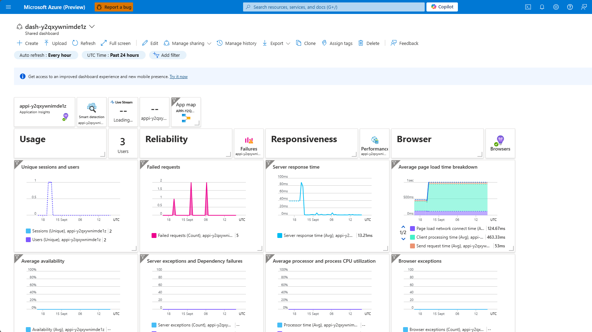

## Challenge 6 - Protect your Azure PaaS (Azure SQL Database) with Disaster Recovery

You can use [the guide](../Infra/App2/setup.md) to deploy an N-tier application, which will be useful for the challenges.

Monitor the resources

## Task 1 - Open the Application Insights dashboard

- Use [`azd monitor`](https://learn.microsoft.com/azure/developer/azure-developer-cli/monitor-your-app) to monitor the application 

Run the following Terminal Command in the directory

    azd monitor

## Task 2 - Navigate through the metrics

Navigate to the Application Insights dashboards:
- overview
- live metrics
- logs

## Success Criteria

- Successfully execute the ``azd monitor`` command.
- Navigate and review the Application Insights dashboards.

### Goal 🎯

In challenge 6, you will focus on implementing disaster recovery strategies for Azure SQL databases using Failover Groups. The primary objective is to ensure business continuity by protecting critical data stored in Azure SQL databases.

### Actions
* Implement Failover Groups for Azure SQL Database:
  * Task 1: Create a Failover Group between two Azure SQL databases located in different Azure regions (Germany West Central and Sweden Central).
  * Task 2: Configure automatic failover policies and test the failover mechanism to ensure seamless transition in case of a disaster.

### Success Criteria ✅
* You have successfully created and configured a Failover Group for Azure SQL Database, ensuring data is replicated and accessible across regions.
* You have conducted failover tests for the Azure SQL Database, demonstrating the effectiveness of your disaster recovery strategy.
* You were able to connect to the failed-over SQL DB from the failed-over VM.

### 📚 Learning Resources
* [Azure SQL Database Failover Groups and Active Geo-Replication](https://learn.microsoft.com/en-us/azure/azure-sql/database/auto-failover-group-overview)
* [Testing for disaster recovery](https://learn.microsoft.com/en-us/azure/site-recovery/site-recovery-test-failover-to-azure)
* [Create a single database in Azure SQL Database](https://learn.microsoft.com/en-us/azure/azure-sql/database/single-database-create-quickstart?view=azuresql&tabs=azure-portal)

**[< BCDR Micro Hack - Home Page](../Readme.md)** | **[< Challenge 5 - Failback to the Primary Region (Germany West Central)](./05_challenge.md)**

### Extra Challenges
* Use `azd monitor` command to create dashboards through Log Analytics Workspace (LAW).
* Deploy the N-tier application with the 'Deploy to Azure' button.
* Implement failover for PaaS Cosmos DB.
* Check WebApp SKUs and upgrade from Basic (without redundancy) to Standard (with redundancy).
