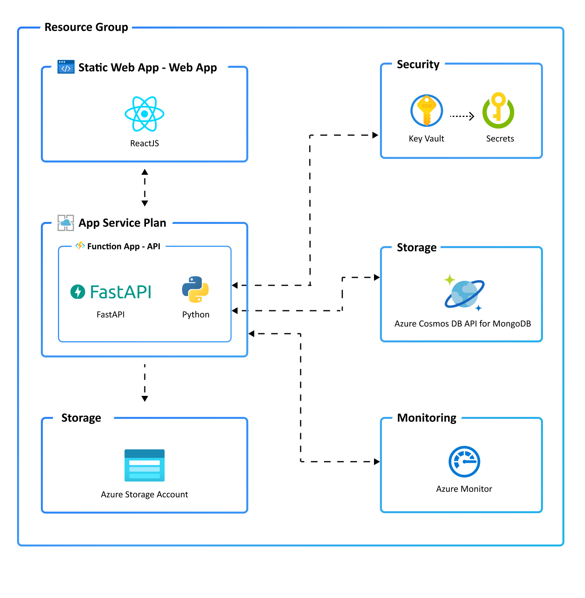

# 🚀 Deploying the Lab environment and an N-tier App

## Introduction
This guide will walk you through deploying a ready-to-go N-tier application and additional resources you need for this lab using the Awesome Azure Developer CLI and Azure Copilot. 
We will use Awesome Azure Developer CLI to deploy a ready-to-go N-tier application. Azure Copilot will help us with what to do and will answer our questions, if we have any.

## Prerequisites
- 🔑 Azure Subscription
- 🛠️ Azure Developer CLI installed (pre-installed in CloudShell - no further action needed)
- 📚 Basic knowledge of Azure services

## Lab Environment & the N-tier Application

To experiment with Azure Monitor & BCDR Solutions and learn how to use it, a lab environment is provided. This includes a sample application, several virtual machines and other Azure services to generate telemetry data.

### N-tier Application



## Guide
By following this guide, you have successfully deployed a ready-to-go N-tier application using the Awesome Azure Developer CLI and Azure Copilot.

## References
- [📄 Azure Developer CLI Documentation](https://docs.microsoft.com/en-us/azure/developer/cli/)
- [📄 Azure Copilot Documentation](https://docs.microsoft.com/en-us/azure/copilot/)

# N-tier Application Deployment

## 1. Initialize the Templates for the N-tier Application
Use the Awesome Azure Developer CLI to initialize the environment.

```bash
azd auth login
```

```bash
azd init --template Azure-Samples/todo-python-mongo-swa-func
```

## 2. Deploy the N-tier Application
Use the Awesome Azure Developer CLI to deploy the N-tier application.

```bash
azd up
```

Use the Awesome Azure Developer CLI to check the status of your deployment.

## 3. Access the Application
Retrieve the URL of the deployed application and open it in your web browser.

**| [< Microhack Overview](../Readme.md) | [Challenge 6 >](./06_challenge.md) |**